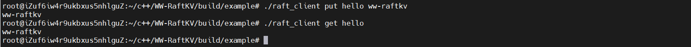

# WW-RaftKV

基于Raft共识算法的分布式 KV 存储

## 一、简介

该项目是一个基于`Raft`共识算法实现的分布式`KV`存储系统，支持节点容错、高可用部署和一致性日志复制。是`WW`系列中学习分布式系统知识后关于`Raft`的简易实现。

## 二、依赖

+ 系统: `Linux` (for `muduo`)
+ 第三方库: `Protobuf3`

## 三、模块

该实现包含了几个核心模块: `KVStore` `RaftRpc` `Raft`

### 1. KVStore

该模块位于`raftkv/kvstore/`，用于提供存分布式存储系统所需要的`KV`存储功能，它的底层实现是跳表。

### 2. RaftRpc

该模块用于提供`Raft`实现中所需要的`Rpc`功能，模块是基于`Google Rpc`框架的扩展。在该框架中，服务端由`Dispatcher`和`ServiceImpl`组成，并用`Server`封装，`ServiceImpl`提供具体方法实现，`Dispatcher`提供`TcpServer`和服务方法表，处理客户端请求；客户端由`Channel`组成，并用`Client`封装，`Channel`提供具体的`TcpClient`连接实现。

#### 服务端

服务端由以下组件组成: 

+ `ServiceImpl`: 封装`Raft`协议中各类`RPC`方法的具体处理逻辑，包括`RequestVote`、`AppendEntries`、`InstallSnapshot`，以及客户端操作`KV`存储所需要的`RaftOperate`方法；
+ `Dispatcher`: 维护服务方法注册表，并内置一个`TcpServer`，用于监听连接并分发请求；
+ `Server`: 对外提供统一的服务端启动接口，整合`Dispatcher`与`ServiceImpl`。

#### 客户端

客户端由以下组件组成: 

+ `Channel`: 封装对某个`Raft`节点的连接与通信逻辑，内部使用`TcpClient`实现持久连接和异步消息发送；
+ `Client`: 管理`Channel`实例，提供面向`Raft`协议调用的高层封装，便于发送`RequestVote`、`AppendEntries`和`InstallSnapshot`请求。

### 3. Raft

该模块位于`raftkv/raft-core`，是关于`Raft`的核心算法实现，它采用状态机模式，不关心网络行为，通过上下文与应用层(`RaftClerk`)通信。它负责处理节点间的选举、日志复制、日志提交以及状态同步等关键流程。该模块遵循`Raft`协议的规范设计，具备良好的可读性与可维护性，核心功能包括: 

+ 节点状态管理: 支持`Follower`、`Candidate`、`Leader`三种角色的状态切换；
+ 选举机制: 实现了基于任期的投票逻辑，支持随机超时选举触发与投票限制；
+ 日志复制: `Leader`将客户端请求转化为日志条目并同步给其他节点；
+ 日志一致性保障: 通过`prevLogIndex`和`prevLogTerm`保证日志匹配性；
+ 日志提交与应用: 日志在被大多数节点确认后提交，并推送给状态机应用；
+ 心跳机制: `Leader`定期发送心跳保持领导地位并触发空日志复制；
+ 任期与投票状态持久化: 防止重启后错误行为；
+ 快照与日志压缩支持: 适用于长时间运行场景下的日志膨胀问题。

## 四、测试

测试代码位于`example/`中，包含了用于模拟启动集群的`raft_example`，使用方法: 

```bash
./raft_example n
```

其中`n`为节点号，该集群中包含`0-8`共9个节点。`example/`中还有两个`shell`脚本，`run.sh`和`stop.sh`，其中，`run.sh`用于启动`2-8`共7个节点，其日志会重定向到`logs/`中；`stop.sh`强制关闭所有`raft_example`进程。

`example/`中还包含了用于模拟客户端操作请求的`raft_client`，使用方法: 

```bash
./raft_client put a b
./raft_client get a
```

`raft_client`默认连接`node 0`，确保在启动集群时，先启动该节点，再启动剩余节点，以保证`node 0`能够当选`Leader`，当`node 0`不为`Leader`时，`raft_client`请求会返回当前`Leader`的`IP`地址和端口用于重定向。

当前存储系统支持的操作有: 

+ `put`: 不允许重复的插入键值对，使用方法为`put {key} {value}`
+ `update`: 更新或插入键值对，使用方法为`update {key} {value}`
+ `get`: 读取已存在的键值对，使用方法为`get {key}`
+ `remove`: 删除已存在的键值对，使用方法为`remove {key}`

## 五、快速启动

这是一个快速使用`Raft`测试集群的示例。

### 1. 编译

```bash
mkdir build && cd build
cmake ..
make -j4
```

### 2. 启动集群

以下按顺序启动。

终端1，启动用于观察`Leader`日志的节点:

```bash
cd build/example/
./raft_example 0
```

终端2，启动用于观察`Follower`日志的节点:

```bash
cd build/example/
./raft_example 1
```

终端3，启动剩余节点:

```bash
cd build/example/
./run.sh
```

终端4，进行想要的操作:

```bash
cd build/example/
./raft_client put hello ww-raftkv
./raft_client get hello
```

### 3. 运行示例

+ node 0


+ node 1


+ node 2-8


+ client


