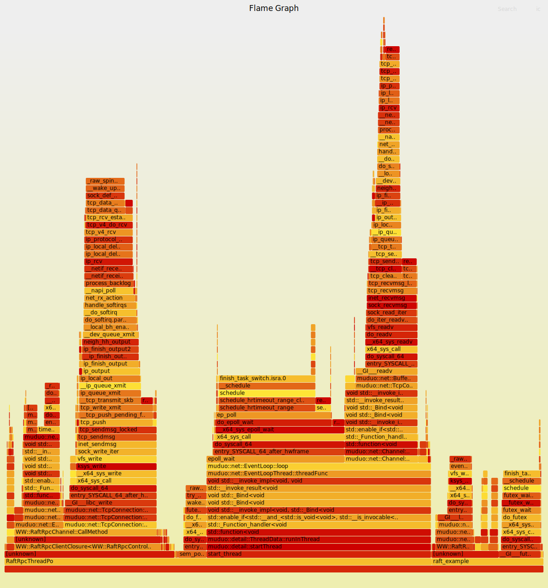

# WW-RaftKV

基于Raft共识算法的分布式`KV`存储

## 一、简介

`WW-RaftKV`是一个基于`Raft`共识算法实现的分布式`KV`存储系统，支持节点容错、高可用部署和一致性日志复制。该项目为`WW`系列的分布式学习项目。

## 二、环境

+ 系统：64位`Linux`操作系统
+ `C++`版本：`C++14`
+ 第三方库：
    + `Protobuf3`
    + `muduo`
    + `concurrentqueue`

## 三、模块

该实现包含了几个核心模块：`KVStore`，`Logger`，`Memory-Pool`，`Raft-Rpc`，`Raft-Core`和`Raft-App`

### 1. KVStore

+ 位于：`raftkv/kvstore/`
+ 功能：是使用跳表实现的`KV`存储，用于提供存分布式存储系统所需要的`KV`存储功能，提供常见的`get`，`put`，`update`和`remove`操作。

### 2. Logger

+ 位于：`raftkv/logger`
+ 功能：是一个轻量化的异步日志库，支持自定义格式化输出、同步和异步日志、轮转日志等，用于提供`Raft`运行时必要的日志输出。

### 3. Memory-Pool

+ 位于：`raftkv/memory-pool`
+ 功能：是一个三级缓存的内存池。它由线程缓存、中心缓存、页缓存三层构成，用于在高频的`Rpc`网络通信中，减小`new`/`delete`动态分配带来的内存碎片和开销。
+ 应用场景：在本项目中，内存池用于`Raft`节点的客户端部分内存管理；服务端部分由于本`Raft`实现的异步设计，请求和响应并不在一个线程中，因此暂不使用内存池，交由`Protubuf`的`Arena`管理。

### 4. Raft-Rpc

+ 位于：`raftkv/raft-rpc`
+ 功能：用于提供`Raft`实现中所需要的`Rpc`功能，该模块是基于`Google Rpc`框架的扩展。

### 5. Raft-Core

+ 位于：`raftkv/raft-core`
+ 功能：实现了`Raft`的核心算法，包括状态机切换、选举、日志复制和推进、心跳等。其核心功能包括：
    + 节点状态管理：支持`Follower`、`Candidate`、`Leader`三种角色的状态切换；
    + 选举机制：实现了基于任期的投票逻辑，支持随机超时选举触发与投票限制；
    + 日志复制：`Leader`将客户端请求转化为日志条目并同步给其他节点；
    + 日志一致性保障：通过`prevLogIndex`和`prevLogTerm`保证日志匹配性；
    + 日志提交与应用：日志在被大多数节点确认后提交，并推送给状态机应用；
    + 心跳机制：`Leader`定期发送心跳保持领导地位并触发空日志复制；
    + 任期与投票状态持久化：防止重启后错误行为；
    + 快照与日志压缩支持：适用于长时间运行场景下的日志膨胀问题。

### 6. Raft-App

+ 位于：`raftkv/raft-app`
+ 功能：实现了`Raft`的应用层，负责节点间的网络通信，并与`Raft`算法层交互。

## 四、测试

测试代码位于`example/`中，包含了以下程序和脚本：

+ `raft_example`：用于模拟启动集群；
+ `raft_client`：用于模拟客户端操作；
+ `run.sh`：启动节点`2-6`；
+ `stop.sh`：关闭所有`raft_example`进程；
+ `clean.sh`：清理上一次运行痕迹。

`raft_example`使用方法：

```bash
./raft_example n
```

其中`n`为节点号，该集群中包含`0-6`共7个节点。`example/`中还有两个`shell`脚本，`run.sh`和`stop.sh`，其中，`run.sh`用于启动`2-6`共5个节点，其日志会重定向到`logs/`中；`stop.sh`强制关闭所有`raft_example`进程；`clean.sh`清理上一次运行产生的痕迹。

`raft_client`使用方法：

```bash
./raft_client put a b
./raft_client get a
./raft_client update a c
./raft_client remove a
```

`raft_client`默认连接`node 0`，确保在启动集群时，先启动该节点，再启动剩余节点，以保证`node 0`能够当选`Leader`，当`node 0`不为`Leader`时，`raft_client`请求会返回当前`Leader`的`IP`地址和端口用于重定向。

当前存储系统支持的操作有：

+ `put`：不允许重复的插入键值对，使用方法为`put {key} {value}`
+ `update`：更新或插入键值对，使用方法为`update {key} {value}`
+ `get`：读取已存在的键值对，使用方法为`get {key}`
+ `remove`：删除已存在的键值对，使用方法为`remove {key}`

## 五、快速启动

### 1. 编译

```bash
mkdir build && cd build
cmake ..
make -j4
```

### 2. 启动集群

以下需按顺序启动。

+ 窗口1，启动用于观察`Leader`日志的节点:

```bash
cd build/example/
./raft_example 0
```

+ 窗口2，启动用于观察`Follower`日志的节点：

```bash
cd build/example/
./raft_example 1
```

+ 窗口3，启动剩余节点：

```bash
cd build/example/
./run.sh
```

+ 窗口4，进行客户端操作：

```bash
cd build/example/
./raft_client put hello ww-raftkv
./raft_client get hello
```

## 六、性能

使用`perf`工具测试`Leader`节点的性能，测试基于`Debug`模式，`-O2`优化，火焰图如下：


